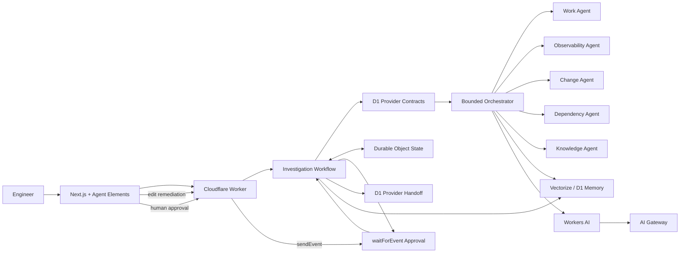

# Org Brain — Cloudflare Assignment Submission

## What it is

Org Brain is an AI-powered engineering intelligence workspace that connects work items, services, repositories, deployments, traces, logs, metrics, incidents, architecture decisions and operational history into one coordinated investigation surface.

Its central design principle is **programmatic first, AI second**. Engineering relationships are resolved through typed provider contracts before Workers AI is asked to reason over the resulting evidence.

## Cloudflare architecture

The submitted runtime uses:

- **Workers** for the investigation/history/memory/approval API
- **Workers AI** with Llama 3.3 for grounded synthesis
- **AI Gateway** for model routing and observability
- **Workflows** for durable multi-step investigation execution
- **Durable Objects** for strongly coordinated per-investigation state
- **D1** for persisted organization entities, investigation history and provider handoffs
- **Vectorize** for production organization memory across prior RCAs, ADRs and work items



The same specialist/context code runs against provider interfaces in every environment. Cloudflare uses the D1-backed provider implementation. When the browser has no Worker URL configured, the portal can still use the deterministic seed-backed provider locally.

## Agent model

Org Brain deliberately avoids an unconstrained autonomous loop. At most three relevant specialists are selected for a query:

- **Work Agent** — work-item impact, conflicts, service boundaries and generated feature/story packages
- **Observability Agent** — traces, logs, metrics and runtime bottleneck localization
- **Change Agent** — deployments, commits, source snapshots and change correlation
- **Dependency Agent** — explicit upstream/downstream traversal and blast radius
- **Knowledge Agent** — ADRs and architecture constraints

Incident analysis keeps observation and code/config attribution separate before synthesis.

## Closed-loop investigation

```text
Incident
  ↓
Trace / Logs / Metrics
  ↓
Deployment / Commit / Source
  ↓
RCA + confidence
  ↓
Historical precedent retrieval
  ↓
Mitigation + editable remediation
  ↓
Human approval
  ↓
D1 provider handoff
  ↓
D1 history + Vectorize organizational memory
```

Historical memory is context, never causal proof. Workers AI is explicitly instructed not to treat a similar past incident as evidence that the current incident has the same root cause.

## Engineering topology

The final demo includes application and platform layers, including WAF, NGINX/edge routing, claims frontend/API/worker, rules, documents, identity, Redis, Kafka and audit/telemetry paths. `/flows` renders representative request/event paths from the same explicit dependency graph used by the Dependency Agent.

## Scenario Lab

The submitted demo contains five deterministic incident packs rather than one hard-coded happy path:

| Scenario | Failure mode | Correlated change |
| --- | --- | --- |
| `INC-2409` | sequential document validation latency | `DEP-2198` / `8fc19b2` |
| `INC-2417` | database pool exhaustion | `DEP-2214` / `c41db71` |
| `INC-2424` | retry amplification | `DEP-2231` / `a90ed31` |
| `INC-2431` | WAF false-positive blocks legitimate multipart uploads | `DEP-2244` / `f3a21d9` |
| `INC-2438` | NGINX proxy timeout returns 504 while the app completes | `DEP-2250` / `b7d992a` |

Each has independent trace, log, metric, deployment, commit and source evidence. Public scenario metadata does not expose hidden expected root causes.

## Evaluation harness

`/evaluations` executes the production orchestrator against the same five scenarios and scores its structured RCA against server-only hidden contracts.

The rubric checks:

- supporting evidence coverage
- affected-service attribution
- deployment attribution
- commit/change attribution
- causal alignment

Only safe aggregate scores are sent to the browser. The expected answer remains server-side.

## Planning intelligence

Planning questions use the same organization model rather than a separate demo path.

Example:

> Plan the implementation for partial settlement support for OPD claims and break it down into work items.

Org Brain resolves `ADO-4231`, its explicit conflict with `ADO-3988`, affected services and relevant ADR constraints. The Work Agent returns a structured draft package containing a feature plus per-service implementation stories and acceptance criteria.

The expanded organization data also supports edge/security planning questions around WAF, NGINX, authentication, audit and observability ownership.

## Human-reviewed remediation

After RCA synthesis:

1. the Workflow enters `waiting-approval`
2. `/remediation/:id` can edit the generated work-item title, description and acceptance criteria
3. edits are saved to Durable Object state and D1
4. Agent Elements captures the approval decision
5. the Worker sends an event to the existing Workflow instance
6. the Workflow reads the **latest** durable remediation draft
7. approved remediation is recorded in the D1 provider-handoff ledger
8. no external system is silently mutated

`/handoffs` makes this boundary inspectable during the demo.

## Organizational memory

`/history` exposes D1-backed investigation history and organization-memory search.

In production, Vectorize can store/retrieve:

- accepted architecture decisions
- work-item context
- completed/root-caused incident summaries

Local Wrangler configuration deliberately omits Vectorize because it has no local emulator. Local memory retrieval degrades to a bounded D1 history-ranking path instead of breaking the Workflow. Production Vectorize calls are also fail-soft, so a memory failure cannot fail an otherwise valid investigation.

## What is real in the submission

- interactive Next.js portal and Agent Elements UI
- bounded specialist orchestration
- deterministic context resolution
- D1-backed organization provider implementation
- five independent incident evidence packs
- hidden-truth RCA evaluation
- failure-mode-specific RCA and remediation generation
- Workers API
- Workers AI + AI Gateway
- Cloudflare Workflows
- Durable Objects
- D1 investigation/history/provider-handoff persistence
- Vectorize organizational memory in production
- D1 local memory fallback
- editable durable remediation
- human approval pause/resume
- runtime health, flows, architecture, history, handoff and evaluation surfaces

## Intentionally externalized

The submitted project does not require reviewer credentials for real enterprise systems. These final external adapters remain intentionally non-mutating:

- Azure DevOps
- GitHub organization/repository APIs
- Elastic / ClickHouse
- Kubernetes/deployment rollback systems

Approval produces a durable provider handoff record, not an unreviewed production mutation.

## Safety / reliability choices

- IDs and graph edges are resolved before LLM reasoning
- specialists receive bounded context
- scenario truth never enters runtime agent context
- historical similarity is explicitly separated from current evidence
- RCA confidence comes from deterministic specialist evidence, not an invented LLM number
- Workers AI has deterministic fallback
- Vectorize has D1 fallback and cannot kill the investigation path
- Workflows persist multi-step execution
- human approval is distinct from execution
- remediation edits are only allowed while waiting for approval
- API inputs are bounded
- external production mutation is disabled for the review environment

## Reviewer demo

The shortest useful sequence is:

1. `/scenario-lab` → inject `INC-2409` or the edge-security `INC-2431`
2. `/` → run the guided RCA prompt
3. observe specialist/tool activity and memory lookup
4. open `/remediation/<investigation-id>` and edit one acceptance criterion
5. approve remediation in Ask
6. `/handoffs` → show the durable provider-handoff record
7. `/flows` → show the explicit WAF → NGINX → application path
8. `/history` → search organization memory
9. `/evaluations` → show hidden-truth regression scoring across all five scenarios
10. `/architecture` and `/runtime` → show how the system is actually wired

See [`DEMO-CHECKLIST.md`](./DEMO-CHECKLIST.md) for exact prompts.

## Run locally

```bash
yarn install
yarn cf:d1:local
yarn cf:dev
```

`cf:dev` uses `wrangler.local.jsonc`, which has no Vectorize binding and uses D1 fallback memory locally.

Frontend `.env.local`:

```bash
NEXT_PUBLIC_ORG_BRAIN_API_URL=http://localhost:8787
```

Then:

```bash
yarn dev
```

## Deploy

```bash
yarn cf:d1:remote
yarn cf:deploy
```

`cf:deploy` ensures the production Vectorize resource/binding exists before deploying the Worker.

Set the Worker `ALLOWED_ORIGIN` to the deployed frontend origin and point `NEXT_PUBLIC_ORG_BRAIN_API_URL` at the deployed Worker.

## Quality gate

```bash
yarn format
yarn lint
yarn typecheck
yarn build
```

Then smoke-test `yarn cf:dev` separately.

## AI-assisted development

AI-assisted development was used throughout the assignment. Representative development prompts and implementation requests are documented in [`AI-COMMANDS.md`](./AI-COMMANDS.md).
