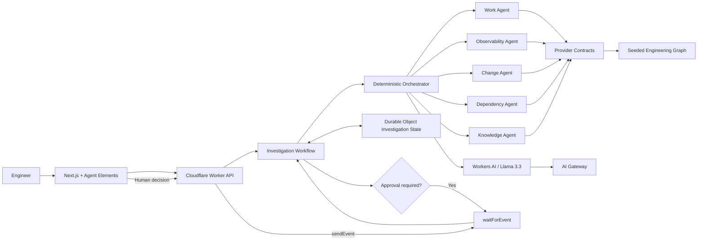

# Org Brain — Cloudflare Assignment Submission

## What it is

Org Brain is an AI-powered engineering intelligence workspace that connects work items, services, repositories, deployments, traces, logs, metrics, incidents, architecture decisions, and operational history into one coordinated investigation surface.

The core design principle is **programmatic first, AI second**. Explicit engineering relationships are resolved deterministically before an LLM is asked to reason over them.

## Why this exists

Production incidents and planning questions rarely live in one system. A developer may need to correlate an incident with traces, a deployment, a commit, a work item, and an ADR before they can answer a simple question such as:

> Why did claims submission latency increase after the latest deployment?

Org Brain models those relationships directly and uses bounded specialist agents to investigate them.

## Cloudflare components

- **Workers AI** — Llama 3.3 synthesis over structured evidence
- **Workers** — API boundary for investigations and approvals
- **Workflows** — durable multi-step investigation execution and human approval pause/resume
- **Durable Objects** — strongly coordinated investigation state
- **AI Gateway** — model-call routing and observability

The architecture is ready for D1 and Vectorize as the persistence and historical-memory layer, but the submitted demo intentionally keeps source engineering entities behind mock provider contracts so the end-to-end investigation remains deterministic and reproducible.

## Architecture



## Agent model

Org Brain uses bounded specialists instead of an unconstrained autonomous loop:

- **Work Agent** — requirement impact, work conflicts, related services
- **Observability Agent** — traces, logs, metrics, runtime bottleneck localization
- **Change Agent** — deployments, commits, source changes, change correlation
- **Dependency Agent** — upstream/downstream graph traversal and blast radius
- **Knowledge Agent** — ADRs and architecture constraints

The orchestrator runs only relevant specialists and caps execution to avoid uncontrolled agent loops.

## Canonical demo

### 1. Inject the incident

Open `/scenario-lab` and inject **Claims submission latency spike**.

The scenario exposes symptoms and observable evidence only. Its hidden evaluation answer is not imported by runtime/client code.

### 2. Investigate

Open Ask and submit:

> Why did claims submission latency increase after the latest deployment?

Expected investigation path:

1. Observability Agent resolves `INC-2409`
2. trace `tr_8b92f17c` is inspected
3. document validation is localized as the dominant leaf span
4. consumer processing and lag regressions are correlated
5. Change Agent inspects deployment `DEP-2198`
6. commit `8fc19b2` and its source snapshot are inspected
7. sequential document validation is identified as the strongest change candidate
8. RCA Synthesizer produces an evidence-backed root cause and confidence

### 3. Human approval

The RCA proposes mitigation and remediation but does not execute either automatically.

Choose **Mitigation + remediation** in the Agent Elements approval question.

The Cloudflare Workflow is resumed with an external event, approval is stored in durable investigation state, and the remediation draft becomes eligible for provider handoff.

No real deployment rollback or external work item mutation occurs in the demo.

## Expected RCA

The seeded evidence is designed to support this conclusion:

> Sequential document validation introduced in `claims-worker` increased consumer processing latency, causing queue lag and downstream claim-processing timeouts.

Evidence includes:

- document validation leaf span around 3.4 seconds
- consumer processing increasing from roughly 42 ms to 890 ms
- consumer lag increasing from roughly 4,200 to 91,000
- CPU and memory remaining comparatively stable
- correlated deployment `DEP-2198`
- `claims-worker` v3.19.2
- commit `8fc19b2`
- source change containing sequential awaits during document validation

## Planning demo

Ask:

> What changes if we support partial settlement for OPD claims?

Org Brain resolves:

- existing related work `ADO-4231`
- explicit conflict with `ADO-3988`
- affected services
- ADR-018 architecture constraint

This demonstrates that the product is not incident-only. The same organization graph supports engineering planning and impact analysis.

## What is real in the submission

- interactive Next.js portal
- Agent Elements chat/tool/approval UI
- deterministic engineering graph traversal
- five specialist agent boundaries
- evidence-backed RCA synthesis
- Cloudflare Worker API
- Cloudflare Workflow execution model
- `waitForEvent` / `sendEvent` approval boundary
- Durable Object investigation state
- Workers AI integration
- AI Gateway configuration
- local fallback when a remote Worker is not configured

## What is intentionally mocked

- Azure DevOps work-item provider
- GitHub repository provider
- Elastic / ClickHouse observability providers
- deployment/rollback execution provider
- final external work-item creation

All mocked systems sit behind provider contracts so production adapters can replace them without changing the specialist/context APIs.

## Safety / reliability choices

- relationships are resolved by IDs before LLM reasoning
- specialists receive bounded structured context instead of raw organization data
- scenario hidden truth is kept separate from runtime evidence
- model output cannot create arbitrary engineering relationships
- approval is distinct from execution
- external mutation is disabled in the demo
- local deterministic fallback remains available if Workers AI is unavailable
- motion respects `prefers-reduced-motion`

## Local run

```bash
yarn install
yarn dev
```

Cloudflare Worker:

```bash
yarn cf:dev
```

Then configure the frontend:

```bash
NEXT_PUBLIC_ORG_BRAIN_API_URL=http://localhost:8787
```

## Quality gate

```bash
yarn format
yarn lint
yarn typecheck
yarn build
```

## AI-assisted development

AI-assisted development was used throughout the assignment. Representative prompts and implementation commands are documented in `AI-COMMANDS.md` as requested by the assignment.
