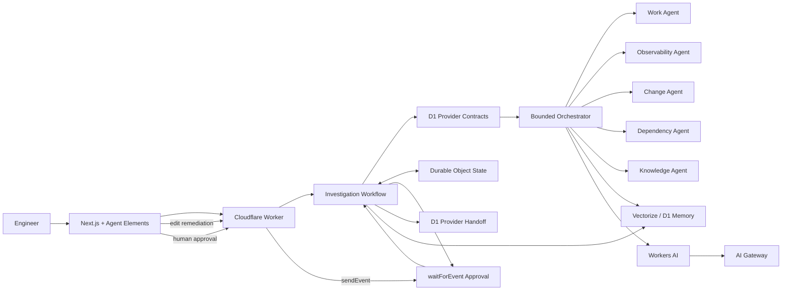

# Org Brain — Cloudflare Assignment Submission

## What it is

Org Brain is an AI-powered engineering intelligence workspace that connects work items, services, repositories, deployments, traces, logs, metrics, incidents, architecture decisions and operational history into one coordinated investigation surface.

Its central design principle is **programmatic first, AI second**. Engineering relationships are resolved through typed provider contracts before Workers AI is asked to reason over the resulting evidence.

## Cloudflare architecture

The submitted runtime uses:

- **Workers** for the investigation/history/memory/approval API
- **Workers AI** with Llama 3.3 for grounded synthesis
- **AI Gateway** for model routing and observability
- **Workflows** for durable multi-step investigation execution
- **Durable Objects** for strongly coordinated per-investigation state
- **D1** for persisted organization entities, investigation history and provider handoffs
- **Vectorize** for organization memory across prior RCAs, ADRs and work items



The same agent/context code can still run locally against the seed-backed mock implementation. Inside Cloudflare, the Workflow self-seeds the coherent demo organization into D1 once and runs those same provider interfaces against persisted data.

## Agent model

Org Brain deliberately avoids an unconstrained autonomous loop. At most three relevant specialists are selected for a query:

- **Work Agent** — work-item impact, conflicts, service boundaries and generated feature/story packages
- **Observability Agent** — traces, logs, metrics and runtime bottleneck localization
- **Change Agent** — deployments, commits, source snapshots and change correlation
- **Dependency Agent** — explicit upstream/downstream traversal and blast radius
- **Knowledge Agent** — ADRs and architecture constraints

Incident analysis keeps observation and code attribution separate before synthesis.

## Closed-loop investigation

```text
Incident
  ↓
Trace / Logs / Metrics
  ↓
Deployment / Commit / Source
  ↓
RCA + confidence
  ↓
Historical precedent retrieval
  ↓
Mitigation + editable remediation
  ↓
Human approval
  ↓
D1 provider handoff
  ↓
D1 history + Vectorize organizational memory
```

Historical memory is context, never causal proof. Workers AI is explicitly instructed not to treat a similar past incident as evidence that the current incident has the same root cause.

## Scenario Lab

The submitted demo contains three deterministic incident packs rather than one hard-coded happy path:

| Scenario | Failure mode | Strongest evidence | Correlated change |
| --- | --- | --- | --- |
| `INC-2409` | sequential validation latency | 3.4s document span, consumer lag | `DEP-2198` / `8fc19b2` |
| `INC-2417` | database pool exhaustion | ~2s connection acquisition, pending pool pressure | `DEP-2214` / `c41db71` |
| `INC-2424` | retry amplification | repeated validation attempts, request amplification | `DEP-2231` / `a90ed31` |

Each has independent trace, log, metric, deployment, commit and source evidence. Public scenario metadata does not expose hidden expected root causes.

## Evaluation harness

`/evaluations` executes the production orchestrator against the same scenarios and scores its structured RCA against server-only hidden contracts.

The rubric checks:

- supporting evidence coverage
- affected-service attribution
- deployment attribution
- commit/change attribution
- causal alignment

Only safe aggregate scores are sent to the browser. The expected answer remains server-side.

## Planning intelligence

Planning questions use the same organization model rather than a separate demo path.

Example:

> What changes if we support partial settlement for OPD claims?

Org Brain resolves `ADO-4231`, its explicit conflict with `ADO-3988`, affected services and relevant ADR constraints. For implementation/planning language the Work Agent also returns a structured draft package containing a feature plus per-service implementation stories and acceptance criteria.

## Human-reviewed remediation

After RCA synthesis:

1. the Workflow enters `waiting-approval`
2. `/remediation/:id` can edit the generated work-item title, description and acceptance criteria
3. edits are saved to Durable Object state and D1
4. Agent Elements captures the approval decision
5. the Worker sends an event to the existing Workflow instance
6. the Workflow reads the **latest** durable remediation draft
7. approved remediation is recorded in the D1 provider-handoff ledger
8. no external system is silently mutated

`/handoffs` makes this boundary inspectable during the demo.

## Organizational memory

`/history` exposes D1-backed investigation history and organization-memory search.

When Vectorize is bound, Org Brain embeds and retrieves:

- accepted architecture decisions
- work-item context
- completed/root-caused incident summaries

If Vectorize is unavailable, historical incident search degrades to a D1 text-search fallback rather than breaking the investigation Workflow.

## What is real in the submission

- interactive Next.js portal and Agent Elements UI
- bounded specialist orchestration
- deterministic context resolution
- D1-backed organization provider implementation
- three independent incident evidence packs
- hidden-truth RCA evaluation
- failure-mode-specific RCA and remediation generation
- Workers API
- Workers AI + AI Gateway
- Cloudflare Workflows
- Durable Objects
- D1 investigation/history/provider-handoff persistence
- Vectorize organizational memory
- editable durable remediation
- human approval pause/resume
- local deterministic fallback
- runtime health, architecture, history, handoff and evaluation surfaces

## Intentionally externalized

The submitted project does not require reviewer credentials for real enterprise systems. These final external adapters remain intentionally non-mutating:

- Azure DevOps
- GitHub organization/repository APIs
- Elastic / ClickHouse
- Kubernetes/deployment rollback systems

The Cloudflare runtime persists provider-shaped demo data in D1 behind the same interfaces those production adapters would implement. Approval produces a durable handoff record, not an unreviewed production mutation.

## Safety / reliability choices

- IDs and graph edges are resolved before LLM reasoning
- specialists receive bounded context
- scenario truth never enters runtime agent context
- historical similarity is explicitly separated from current evidence
- RCA confidence comes from deterministic specialist evidence, not an invented LLM number
- Workers AI has deterministic fallback
- Workflows persist multi-step execution
- human approval is distinct from execution
- remediation edits are only allowed while waiting for approval
- API inputs are bounded
- external production mutation is disabled for the review environment

## Reviewer demo

The shortest useful sequence is:

1. `/scenario-lab` → inject `INC-2409`
2. `/` → run the guided RCA prompt
3. observe specialist/tool activity and memory lookup
4. open `/remediation/<investigation-id>` and edit one acceptance criterion
5. approve remediation in Ask
6. `/handoffs` → show the durable provider-handoff record
7. run `INC-2417` or `INC-2424`
8. `/history` → search organization memory
9. `/evaluations` → show hidden-truth regression scoring
10. `/architecture` and `/runtime` → show how the system is actually wired

See [`DEMO-CHECKLIST.md`](./DEMO-CHECKLIST.md) for exact prompts.

## Run

```bash
yarn install
yarn cf:memory:setup
yarn cf:dev
```

Frontend `.env.local`:

```bash
NEXT_PUBLIC_ORG_BRAIN_API_URL=http://localhost:8787
```

Then:

```bash
yarn dev
```

## Deploy

```bash
yarn cf:deploy
```

Current Wrangler automatically provisions the D1 resource from the checked-in binding when needed. `cf:deploy` also creates/binds the 768-dimensional `org-brain-memory` Vectorize index before deployment.

Set the Worker `ALLOWED_ORIGIN` to the deployed frontend origin and point `NEXT_PUBLIC_ORG_BRAIN_API_URL` at the deployed Worker.

## Quality gate

```bash
yarn format
yarn lint
yarn typecheck
yarn build
yarn cf:dev
```

## AI-assisted development

AI-assisted development was used throughout the assignment. Representative development prompts and implementation requests are documented in [`AI-COMMANDS.md`](./AI-COMMANDS.md).
